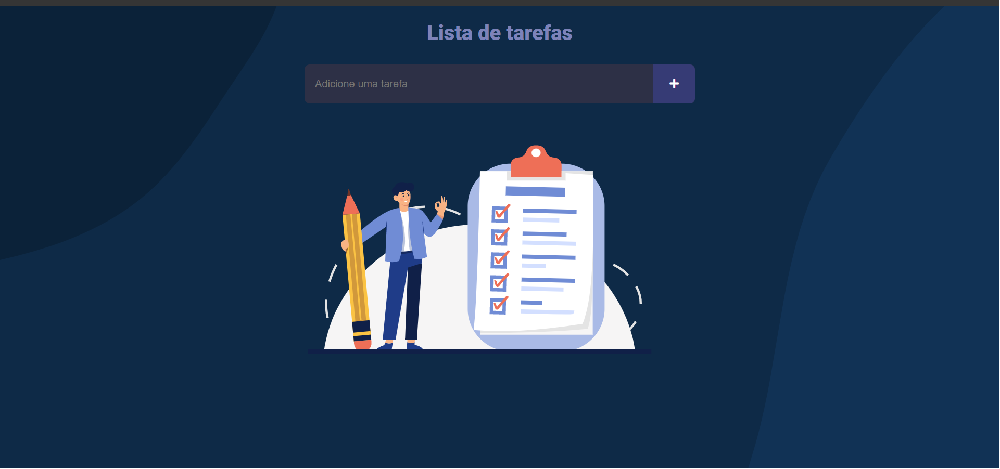
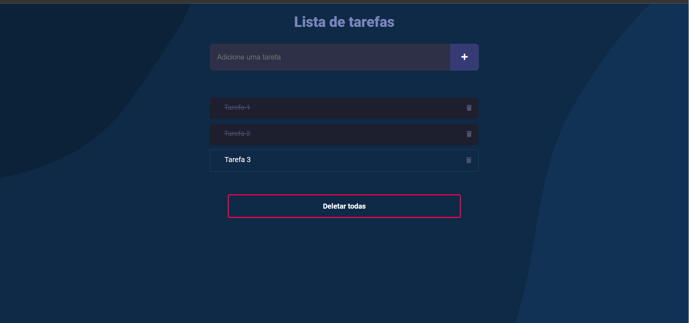

# Lista de Tarefas em React

## Visão Geral
Este é um projeto React de uma simples lista de tarefas. A aplicação utiliza os conceitos mais recentes do React, como Hooks e Componentes.

Além disso, a aplicação utiliza o LocalStorage para armazenar a lista de tarefas, permitindo que os usuários mantenham suas tarefas salvas mesmo após o fechamento do navegador. O hook useEffect é utilizado para atualizar o LocalStorage toda vez que a lista de tarefas for atualizada.

## Funcionalidades
A aplicação utiliza o LocalStorage para armazenar a lista de tarefas, permitindo que os usuários mantenham suas tarefas salvas mesmo após o fechamento do navegador. Além disso, utiliza o hook useEffect para atualizar o LocalStorage toda vez que a lista de tarefas é atualizada.

As funcionalidades incluem:

- Adicionar uma nova tarefa
- Marcar ou desmarcar uma tarefa como concluída
- Remover uma tarefa
- Remover todas as tarefas

## Como utilizar
1. Clone o repositório
2. Instale as dependências com o comando npm install
3. Inicie o servidor com o comando npm start
4. Abra o navegador em http://localhost:3000

## Tecnologias utilizadas
- React
- JavaScript
- CSS
## Licença
Este projeto está licenciado sob a Licença MIT. Consulte o arquivo LICENSE para obter mais informações.